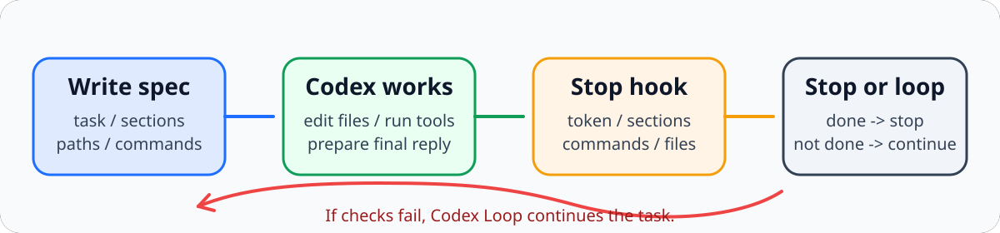

# codex-loop

`codex-loop` 是一个开源 Codex 插件，用 `Stop` hook 把普通对话收口成“带完成条件的循环执行”。

它解决的是这类场景：

1. 你先定义“什么才算完成”。
2. 让 Codex 正常工作。
3. 每轮结束时，`Stop` hook 检查最后回复是否满足完成条件。
4. 如果没满足，就自动要求 Codex 继续。

当前版本刻意保持“显式规则驱动”，不去做黑盒语义猜测，这样可检查、可调试、可控。



## 一键安装

直接执行：

```bash
bash <(curl -fsSL https://raw.githubusercontent.com/fruktoguo/codex-loop/main/install.sh)
```

安装脚本会先打印当前要安装的版本号，例如 `Installing codex-loop v0.1.3 ...`。

这条命令会一次性完成：

- 检查 `codex` CLI 是否存在
- 把 `codex_hooks = true` 写入 `~/.codex/config.toml`
- 把本仓库作为 marketplace 加到 Codex
- 启用 `codex-loop@codex-loop`
- 安装本地辅助脚本：`codex-loop-init`、`codex-loop-status`、`codex-loop-validate`

安装完成后，重启 Codex 即可生效。

如果你已经把仓库 clone 到本地，也可以直接在仓库根运行：

```bash
./install.sh
```

如果之前已经安装过，更新方式仍然是重新运行安装脚本；安装输出里会显示当前安装的版本号，方便确认是否已经更新到目标版本。

## 插件做什么

- 提供插件级 `Stop` hook
- 读取当前工作仓库中按 session 绑定的 `.codex-loop/specs/<session-id>.json`
- 完成后把当前 session 的 spec 归档到 `.codex-loop/history/` 并移除该活动 spec
- 要求先把当前 session spec 的 `completed` 改为 `true`，再允许结束
- 保留 `done_token` 兼容字段，但循环停止不依赖回复文本
- 支持“候选收尾阶段”运行真实命令检查
- 支持要求某些路径必须真的被修改或生成
- `required_paths_modified` 会记录创建 spec 时的路径快照；即使修改后来被提交、当前工作区变干净，也能按快照判断是否确实变过
- 判定修改时会排除 `.codex-loop/` 控制文件，避免 spec/runtime 自身变化误算为任务成果
- 路径 gate 和命令 `cwd` 只能指向当前仓库内，避免 spec 误写到仓库外路径
- 用 `max_rounds` 防止无限循环
- 把运行态写到当前仓库的 `.codex-loop/runtime/`

## 工作模型

`codex-loop` 当前使用明确契约：

- 当前项目里可以同时存在多个 `.codex-loop/specs/<session-id>.json`
- Stop hook 只会读取当前 `session_id` 对应的那份 spec，其他 session 不受影响
- 当前 session 的 spec 是循环结束开关；AI 必须实际编辑这份 JSON，把顶层 `completed` 从 `false` 改成 `true`
- Codex 只有在最后一条 assistant 回复同时满足以下条件时才算完成：
  - 当前 session spec 里的 `completed` 是 `true`
  - 如果配置了 `required_paths_modified`，这些路径必须相对 spec 创建时的快照发生变化；旧 spec 没有快照时回退到 git status 判定
  - 如果配置了 `required_paths_exist`，这些路径必须真的存在
  - 如果配置了 `commands`，这些命令必须按预期退出码通过
  - `done_token` 和 `required_sections` 仍会记录，但不再作为停止的硬门槛
- 如果不满足，`Stop` hook 返回 `decision: "block"` 和 continuation reason，让 Codex 继续

这还不是“全自动项目经理”，但已经是一个稳定、透明、可追踪的 completion gate。

## 快速开始

标准使用方式是直接在 Codex 里引用技能并描述任务，例如：

```text
$codex-loop 修复当前仓库里的构建错误，并确认 pnpm build 通过后再结束。
```

或者：

```text
$codex-loop 创建一个循环任务：每次只回复 hello，第 3 次结束。
```

收到这种请求后，Codex 会自己完成这几步：

1. 在当前目录创建或刷新当前 session 的 `.codex-loop/specs/<session-id>.json`
2. 校验 spec 内容合法且符合任务
3. 再按这个 spec 继续执行任务

生成出的 spec 一般类似：

```json
{
  "enabled": true,
  "completed": false,
  "task": "Fix the failing test and verify the result.",
  "done_token": "STOPGATE_DONE",
  "required_sections": [
    "完成了什么",
    "验证结果",
    "剩余风险"
  ],
  "required_paths_modified": [
    "packages/server/src/"
  ],
  "required_paths_exist": [],
  "commands": [
    {
      "label": "typecheck",
      "command": "pnpm build",
      "cwd": ".",
      "expect_exit_code": 0
    }
  ],
  "max_rounds": 99
}
```

如果 spec 正确，之后的 Stop hook 会自动接管续跑。若当前 session spec 没有被改成 `completed: true`，或没有满足命令检查、路径检查，Codex Loop 会继续当前任务。命令检查会先执行，再判定文件是否存在或是否相对基线发生变化，因此可以用命令生成最终产物。

任务真正完成时，AI 应先修改当前 session 的 `.codex-loop/specs/<session-id>.json`，把顶层字段 `"completed": false` 改成 `"completed": true`，然后再按任务要求输出最终交付。仅在回复文本里说明“已完成”或写出 `done_token` 不会停止循环。

纯文本循环任务则应使用更小的 spec，而不是默认三段式结构。例如“每轮只回复 hello，第 3 轮结束”这类任务，应把 `required_sections`、`required_paths_modified`、`required_paths_exist`、`commands` 都设为空。

## 辅助命令

下面这些命令仍然存在，但它们是辅助工具，不是推荐给最终用户的标准交互方式：

```bash
codex-loop-init
codex-loop-status
codex-loop-validate
```

适合的场景主要是：

- 本地调试 plugin 行为
- 手工检查当前 spec 是否合规
- 在没有明确走技能触发的情况下做诊断

## 仓库结构

本仓库是一个 Codex marketplace root：

```text
.agents/plugins/marketplace.json
install.sh
scripts/install.py
plugins/codex-loop/
```

插件本体位于：

```text
plugins/codex-loop/.codex-plugin/plugin.json
plugins/codex-loop/hooks.json
plugins/codex-loop/scripts/codex_loop_stop_hook.py
plugins/codex-loop/skills/codex-loop/SKILL.md
```

安装器额外放到用户目录的辅助脚本位于：

```text
~/.local/bin/codex-loop-init
~/.local/bin/codex-loop-status
~/.local/bin/codex-loop-validate
~/.local/share/codex-loop/
```

运行时文件不会写进插件目录，而是写进你当前工作的仓库：

```text
.codex-loop/specs/<session-id>.json
.codex-loop/history/<timestamp>-<session-id>.json
.codex-loop/runtime/<session-id>.json
```

## 局限

- 当前完成判定是规则型，不是语义型
- 只有当回复已经像“候选最终交付”时，才会运行命令检查；这样可以避免每轮都跑昂贵命令
- 如果你需要跨仓库队列、长周期任务编排、外部回调，应该把它再接到 Codex SDK runner 上

## 开发验证

本地 smoke：

```bash
python3 plugins/codex-loop/scripts/codex_loop_stop_hook.py < plugins/codex-loop/examples/stop-event.json
```

本地安装验证：

```bash
./install.sh
```

## Privacy

Stop hook 只读取 Codex 提供的 Stop event payload，并把本地 runtime JSON 写到当前仓库的 `.codex-loop/runtime/`。当前版本不会调用外部服务。

## License

MIT
